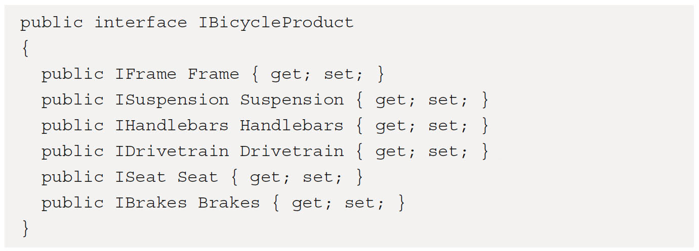
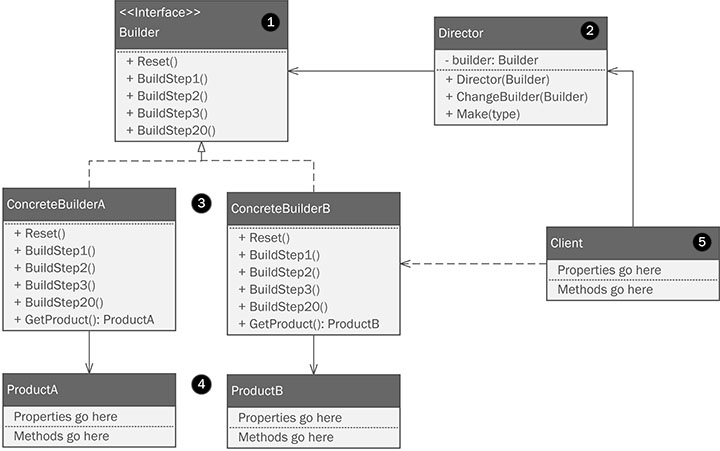
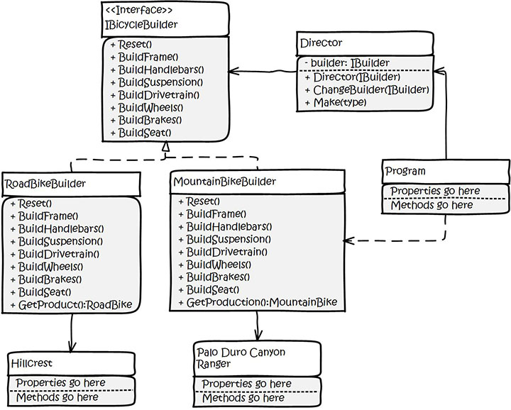
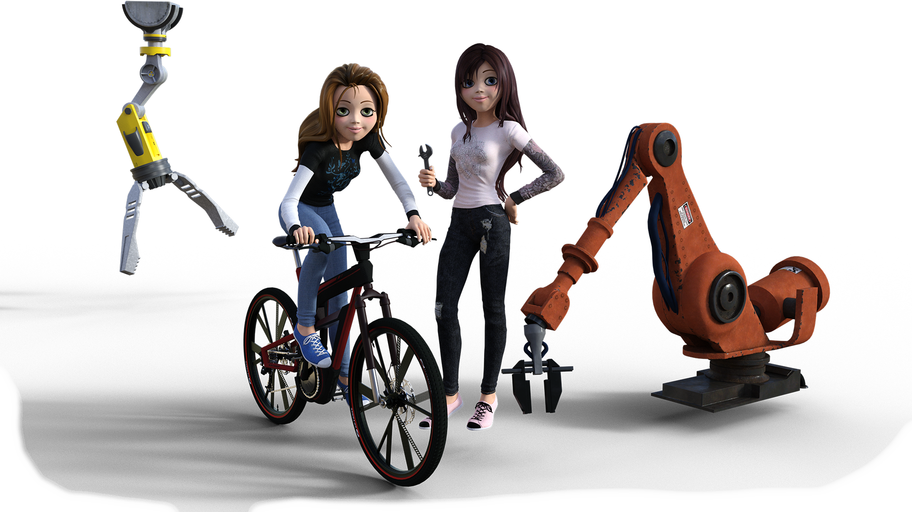

# Real World Implementation of C# Design Patterns

## Solve Daily Programming Challenges Using Elements of Reusable Object-Oriented Software

### A book written and illustrated by [Bruce M. Van Horn II, CSM](https://www.linkedin.com/in/brucevanhorn2/)

<a href="https://csharppatterns.dev"></a>

### This is the code repository for [Real World Implementation of C# Design Patterns](https://csharppatterns.dev)

---
This is not your classic book with an academic treatment. Instead, the book will explore real-world
applications of design patterns in C# which will be useful in your everyday work. The book will allow
software developers to recognize & deliver solutions to the common challenges faced time and again during
software design in C# across all industries.

## What is this book about?

Software development as a profession has been around for over 50 years now. As an industry, we’re pretty
good at teaching new languages, and basic theory like algorithms, data structures, Big O notation and the
like. But there is a difference between software development and software engineering. Engineers need to
be able to think about more than just syntax and clever uses of linked lists. They also need to learn programming
paradigms and how to use software design patterns as both a communications tool and as an advantage when designing
well written, easily maintainable code.

The usual academic writing style is replaced with a science-fiction novella. Our story's heroes are Kitty and Phoebe –
Texas-born sisters who share a love for riding bicycles. Phoebe is studying engineering at Southern Methodist University, 
in the sisters’ hometown of Dallas, Texas. Kitty is studying industrial design at Sul Ross University in the
town of Alpine located in west Texas. Purely through kismet, they both won a summer internship at *MegaBikeCorp* (dun dun dun!), 
a large multi-national bicycle manufacturing company.

After three months of soul crushing big-company bureaucracy, the girls decided they could do better. Kitty designs a
new line of incredibly innovative bicycles. Her sister has the idea to create an automated robotic assembly line that 
would be the envy of Elon Musk. The sisters find two abandoned warehouses: one in Dallas, the other in the city of Alpine. 
The two set up shop with the help of their father's Darmstadtium (which is better than Platinum) credit card. 
(Don't worry, they pay him back and nobody dies from radiation poisoning!)

Throughout the story, the sisters are working on building the software systems that will control their robotic
manufacturing facilities. You'll be working alongside them, learning as they do, and occasionally making mistakes, and
then correcting them.

Through this story based knowledge transfer, developers working with C# will be able to put their knowledge to work with this practical guide to design patterns. The
book provides a hands-on approach to implementation and associated methodologies that will have you up-and-running, and
productive in no time.

Complete with step-by-step explanations of essential concepts, practical examples, and self-assessment questions, you
will begin by exploring what patterns are. Throughout the book, you'll learn how to leverage them in your daily work,
and even how to recognize and correct for anti-patterns that invariably worm their way into your projects.

You’ll learn to recognize solutions to common problems in software design with C# that come up time and again regardless
of where you work or what industry you serve. Rather than an academic treatment that you’ll find in “classic” books on
this topic, we’ll be exploring real-world applications of design patterns that you can use in your everyday work.

By the end of this book, you’ll be able to recognize situations where you are tempted to reinvent the wheel, and quickly
avoid the time and cost associated with solving problems that are common, well understood, with battle tested, and
proven design patterns.

You'll wield patterns with confidence, and you do it with *CLASS*! (And sometimes interfaces).

### What You Will Learn

1. Define software design patterns within the context of real-world software development challenges.
2. Explore the most common and immediately useful patterns that always come up in your everyday work, even if you don't
   know they're there now.
3. Recognize and deal with common anti-patterns and de-evolutionary forces that will wreck your project. This is
   probably happening right now!
4. Learn to apply SOLID principles to your design thinking and coding practice.
5. Use creational patterns to create flexible and robust object structures without a lot of boilerplate code and wasted
   effort.
6. Enhance class designs with structural patterns to keep your code easy to extend without introducing new bugs.
7. Simplify object interaction and behaviour with behavioural patterns to keep your objects working together as part of
   a well-oiled machine.

## Instructions and Navigation

This code is designed to be used with any of the three most popular modern integrated development environments (IDE):

* [Visual Studio](https://www.visualstudio.com)
* [Rider](https://www.jetbrains.com/rider/)
* [Visual Studio Code](https://www.visualstudio.com)

The code for the book is organized into physical folders respective to each chapter. For example chapter-4 will house
the code for Chapter 4. Note that not every chapter has source code, for example Chapter 6, which covers designing your
project with UML before you code, so there may be gaps in the folder numbering. We create a code library in Chapter 3
called ```BumbleBikesLibrary``` to house re-usable code that appears in subsequent chapters. The printed code from the
book looks like this:



Note that the book is printed in black and white, so the color formatting shown in your favorite IDE will not appear in
the book.

You must also remember that when you open the solution file, ```RealWorldCSDesignPatterns.sln``` using Visual Studio or
Rider, the folder structure you see within the solution explorer is not the same as the raw folder structure. Both of
those IDEs use a virtual folder structure based on the contents of the solution file.  Within these IDEs, some of the files 
visible in the physical folders of the code repository might not be visible within the IDE without adjusting the project 
explorer window. 

The solution file contains a single solution for all of the code in the book. Each chapter is set up as a project folder
allowing you to run a specific chapter's code easily. All of the projects are simple command line applications, so they
should be compatible what your operating system. The software and hardware requirements for the code are listed below.

Throughout this book, I assume you know how to create new C# projects in your favorite integrated development
environment (IDE), so I won’t spend any time on the mechanics of setting up and running projects. If you need a
refresher on any of the IDEs mentioned, or a review of C# in general, you should read Appendix 1 of the book.

Given this is a book on software design patterns, you should be prepared to review a lot of class diagrams created using
the Unified Modeling Language (UML). If you've never come across UML diagrams before, or you need a refresher, review
Appendix 2 of the book. There are two styles presented for each pattern: a generic form and a specific implementation applied
to a real-world business problem explained in the text.

A generic UML class diagram will look like this:



The numbered areas are used to explain the parts of the pattern in the accompanying text.

A specific application of the pattern will appear as though the characters in the book drew the diagram ona whiteboard (
with impossibly legible penmanship) and will appear like this:



## Software and Hardware List

To run the code in this repository you'll need the following:

* A Git client, for example [Git for Windows](https://gitforwindows.org/), is needed to clone the repository
* A computer running the Windows operating system. I’m using Windows 10. Since the projects are simple command-line
  projects, I’m pretty sure everything here would also work on a Mac or Linux, but I haven’t tested the projects on
  those operating systems.
* A supported IDE such as [Visual Studio](https://visualstudio.com), [JetBrains Rider](https://www.jetbrains.com/rider/)
  , or [Visual Studio Code](https://www.visualstudio.com)
  with [C# extensions](https://code.visualstudio.com/docs/languages/csharp). I’m using Rider
  2021.3.3.
* The .NET Core 6 SDK.

## Related Products

* [Parallel Programming and Concurrency with C# 10 and .NET 6](https://www.packt.com/product/uncategorized/b18552-parallel-programming-and-concurrency-with-c-10-and-net-6/)
* [High Performance Programming in C# and .NET](https://www.packt.com/product/programming/b16617-high-performance-programming-in-c-and-net/)
* [Practical Remote Pair Programming](https://www.packt.com/product/business-other/b16902-practical-remote-pair-programming/)
* [UML 2.0 in Action: A Project Based Tutorial](https://www.packt.com/product/programming/b03179-uml-2-0-in-action-a-project-based-tutorial/)

## Visit the Author's Companion Website

For more book-related excitement and additional resources, I hope you'll visit my companion website for this book
at [https://csharppatterns.dev](https://csharppatterns.dev).

